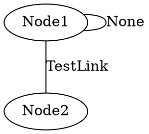

## What is a Graph datastructure ?

First, we (or [wikipedia](https://en.wikipedia.org/wiki/Graph_(abstract_data_type))) will define what a graph is:
> In computer science, a graph is an abstract data type that is meant to implement the undirected graph and directed graph concepts from the field of graph theory within mathematics. 
A graph data structure consists of a finite (and possibly mutable) set of vertices (also called nodes or points), together with a set of unordered pairs of these vertices for an undirected graph or a set of ordered pairs for a directed graph. These pairs are known as edges (also called links or lines), and for a directed graph are also known as edges but also sometimes arrows or arcs. The vertices may be part of the graph structure, or may be external entities represented by integer indices or references.

To reformulate: a graph is a list of nodes linked together with edges. A graph can be directed, which means the edges also have a direction (from a certain to another one) or undirected (there is no specific direction for a link). There is also graphs that have specific properties that have their own names and can be used as a specific datastructures, such as Trees.

Graphs are really usefull, they can be used to solve problems or modelize specific domains. For instance, a genealogical tree is graph,Networking in computer science use graph all the time, for example to perform routing tasks. Roads and Airport connections is also a graph that can be directed, and edges can have values (or weighs), for instance the distance between two destinations.

Here is some visuals representations of graphs:
{: .align-center}

{: .align-center}

## Graph Representation

There is two main representation of a graph (and variations):

- Adjacency Matrix
- Adjacency List


### Adjacency Matrix
Let's say we denote nodes from 0 to n-1.
An adjacency matrix is a 2D array where a link between node i and node j is present if the value in the array at position (i, j) is 1. 

They both work for directed and undirected graph, and we can even put specific values instead of 1.

For an undirected graph: 
{: .align-center }
The associated matrix would be: $$\begin{bmatrix}
1 & 5\\
5 & 1
\end{bmatrix}$$
Notice that the matrix will be symetrical.

For a directed graph:

{: .align-center }

The associated matrix would be: $$\begin{bmatrix}
1 & 5\\
0 & 0
\end{bmatrix}$$

### Adjacency List

This representation is used to store all the links of a node.
Let's show another graph and build the adjacency list: 

{: .align-center }


We will take each nodes, and for each, get all the links and the associated node. For an undirected graph, a link is added in the adjacency list of both nodes. 

{: .align-center }

### Adjacency Set

Adjacency set is using the same principle has Adjacency List, storing only links related to each node. This difference is that instead of using a list, we use a mapping. Instead of iterating through each neighbors one by one, we have constant time access by using a map function, like hashing. 

### Why should I use Adjacency Matrix or Adjacency List ?

You may ask yourself, if there is multiple representations, is there one better than the other ?

The answer is yes ... and no ! In fact, It just depends on what type of operations you will perform on the graph. Let's compare their space and time [complexity](https://en.wikipedia.org/wiki/Computational_complexity#Time)). n is for nodes, l for links, v for the number of links of a given node.

|  | Adjacency Matrix | Adjacency List | Adjacency Set |
|---|---|---|---|
| Space Complexity | O(n²) | O(n+l) | O(n+l) |
| Adding link | O(1) | O(1) | O(1) |
| Removing Link | O(1) | O(v) | O(1) |
| Checking if link exists | O(1) | O(v)  | O(1) |
| Iterating throughs neighbors | O(n) | O(v) | O(v) |

Ok, so we can explain how we figured out those complexities and when we can use one or the other.

#### Space Complexity

Obviously, the Matrix will always have an array allocated to store all links between each nodes, so you will have n*n space taken.
For List and Set, we store only nodes and their neighbors: O(n+l). In the case we have fully connected graph (every node are connected), then we go back to the O(n²).


### Python implementation of undirected graph using Adjacency Sets:

All the sources of this implementation are available [here](https://github.com/Smixi/learning-datastructures/tree/main/python/graph)

To implement the an undirected graph through adjacency Sets, we will keep track of nodes in a dictionnary, where the key of the dict is a unique node identifier, and where the value of the key is anything we want, that the user want to store.

For links, we will create another dictionnary, where the key of each entry is the unique link identifier, but the value is another dictionnary. For this nested dictionnary, the nested key will represent any connected node identifier to the main key node identifier, and the value associated is the link value for this specific connection.

```python
from typing import TypeVar, Generic, Dict, Hashable
NV = TypeVar('NV')
EV = TypeVar('EV')

class UndirectedGraph(Generic[NV, EV]):

    def __init__(self) -> None:
        super().__init__()
        self.nodes: Dict[Hashable, NV] =  dict()
        self.links: Dict[Hashable, Dict[Hashable, EV]] = dict()
```
We use TypeVar to type the value contained in links and nodes, and we expect an identifier to be an Hashable.

Now, our graph have the necessary attributes, we can add methods to add and removes nodes.

```python
def add_node(self, node: Hashable, value: NV=None) -> None:
    if node is None:
        raise ValueError("None value cannot be used as a Node")
    
    if node not in self.nodes:
        # We initialize the entry in the adjency dict for this node.
        self.links[node] = {}
    self.nodes[node] = value
```

While None is a valid hashable, I prefer to not use it, because it can lead to issues later on, so we just check that the user input is valid. Now, If the node id is not in the graph, we create adjacency set for this node. If the node existed, we update its value, if it didn't, we also create the node in the sets of nodes, with its associated value.

```python
def remove_node(self, node: Hashable):
    if node not in self.nodes:
        raise ValueError("The given node is not in the graph")
    # Delete the node
    del self.nodes[node]
    # Delete all links which contains this node
    connected_nodes = self.links[node]
    for connected_node in connected_nodes:
        del self.links[connected_node][node]
    del self.links[node]
```

To remove a node from the graph, we first check that it is actually present in it. Then, we remove the entry in the node set, and remove links that have this node in the connection. To do that, we iterate over the connected nodes to delete all "backward links", and then finally remove the entire links for this nodes. Why ? Let's see the creation of a link !

```python
    def add_link(self, node1: Hashable, node2: Hashable, link_value: EV = None, node1_value: NV = None, node2_value: NV = None):
        # Check that each node exists first.
        if node1 not in self.nodes:
            self.add_node(node1, node1_value)
        if node2 not in self.nodes:
            self.add_node(node2, node2_value)
        
        # Add the link in the adjency dict for both node.
        self.links[node1][node2] = link_value
        self.links[node2][node1] = link_value
```

Again, we will check that each node that will be part of the link exists in the graph. Missing nodes will be created through the previously described function. Also, if the node already exists, we don't update its value.
Then we simply create the link in the adjacency list of node1, and in the adjacency list of node2. This is specific to undirected graph where there is not direction for the connection. A quick reminder: a node can link to itself, so the last line will be executed but have no effect.

```python
def remove_link(self, node1: Hashable, node2: Hashable):
    if node1 not in self.nodes:
        raise ValueError("First node of the given link is not in the graph")
    if node2 not in self.nodes:
        raise ValueError("Second node of the given link is not in the graph")
    del self.links[node1][node2]
    if node1 != node2: # A link can connect the node to itself, but we can't delete it twice.
        del self.links[node2][node1]
```

For the deletion, we check first that the links exists, and then we delete the relationship from node1 to node2. Because of a node self referencing itself in a link, we need to check the given nodes are different, because access the backward link will fail.

Good ! Now we can play with graph. We can add and remove nodes, and add and removes nodes.

Let's create tests to ensure we properly implemented everything. For that I'm using pytest. I'll only show you one test, but there should be atleast one for every possible case and methods we want to check.

```python
def test_undirect_graph_add_link():
    g: UndirectedGraph[int, str] = UndirectedGraph()
    g.add_node(1,1)
    g.add_link(1,2, "LinkValue", node1_value=-1, node2_value=1)
    assert g.links == {1: {2: "LinkValue"}, 2: {1: "LinkValue"}}
    assert g.nodes == {1: 1, 2: 1}
```

This tests checks that we can properly add a link between two nodes, one already exists (and its value must not be modified) and the other doesn't.

Executing the tests gives: 

```
============================= test session starts ==============================
platform linux -- Python 3.10.1, pytest-7.2.0, pluggy-1.0.0
rootdir: /home/smixi/learning-datastructures
collected 1 item

python/graph/tests/test_undirected_graph.py .                            [100%]

--------------- generated xml file: /tmp/tmp-760QXCUziiBDMDJ.xml ---------------
============================== 1 passed in 0.01s ===============================
```

Great ! 

Let's print a graph and its associated links and nodes dictionnary in python. Try to guess from the image first what their contents will be.
{: .align-center }

**Nodes**: 
```python
{'1': 'Node 1', '2': 'Node 2', '3': 'Node 3', '4': 'Node 4'}
```
**Links**: 
```python
{
    '1': {'2': 'Link1'}, 
    '2': {'1': 'Link1', '3': 'Link2', '2': 'Link3', '4': 'Link4'},
    '3': {'2': 'Link2'}, 
    '4': {'2': 'Link4'}
}
```

Now that we can create and manipulate a graph, we want to print it ! Obviously, we can print the attributes of our object, but that would not visual ...
To simplify the rendering of a graph, we can use Graphviz and its [Python bindings](https://graphviz.readthedocs.io/en/stable/manual.html).

Thanks to this python library, we can add a rendering method with ease:
```python
from graphviz import Graph
...
    def render(self, filename: str, graph_name: str, format: str = "svg"):

        dot = Graph(graph_name, format=format)

        for node, node_value in self.nodes.items():
            dot.node(str(node), str(node_value))
        
        added_links = set()

        for source_node, dest_nodes in self.links.items():
            for dest_node, link_value in dest_nodes.items():
                # Check the link is 
                if (dest_node, source_node) in added_links:
                    continue
                added_links.add((source_node, dest_node))
                dot.edge(str(source_node), str(dest_node) , label=str(link_value))
        dot.render(filename)
```

First of all, we create a graphviz Graph object. We then add all the nodes one by one to the graph. Notice that graphviz expect str object as identifier and node value, because our implementation handle any object type, the user will have to either to implement  ____str____ methods on the hashable type or value (or simply use string ...)

We create a set that will be use to know if a link has already been added to the Graphviz object. This set is populated with tuple (node1, node2) for each link. Before adding a link to the graph, we check that the backward link (node2, node1) is not in this set. If it is, it means this link is already present. We do that because there is no identifier for a graphviz edge, so adding (node1, node2) and (node2, node1) for the same link identifier will result in two edges in graphviz.

Now, we can render a simple graph:

```python
g: AdjacencySetUndirectedGraph[int, str] = AdjacencySetUndirectedGraph()
g.add_link(1, 2, "TestLink", "Node1", "Node2")
g.add_link(1,1)

g.render(path, "TestGraph", "dot")
```

Gives the following dot file and svg:


{: .align-center }
